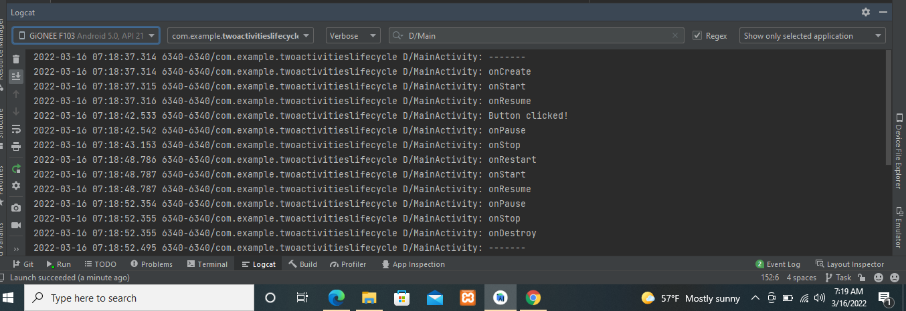

# Lab Work 5
## Two Activities Life Cycle 

**This is the fifth lab Exercise "Activities-and-intents" with two textView ,Button and Edittext as this readme file consist of the screenshot and video i.e. gif file for the final app created**

### Observe the log as the app runs

**The above screenshot show the Logcat of the application**