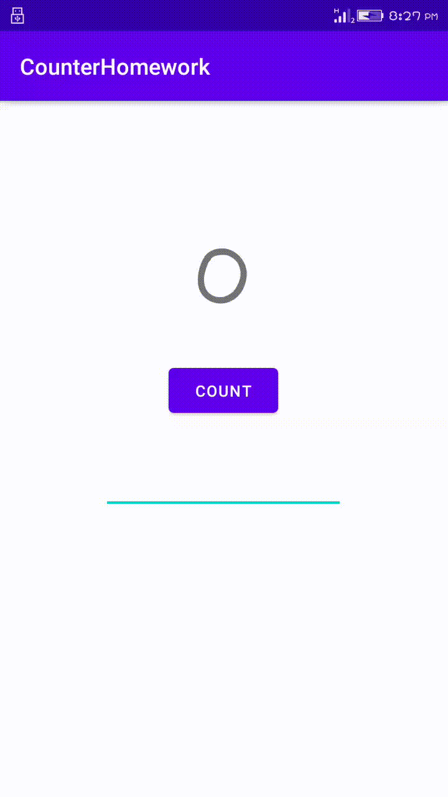

# Lab Work 5
## Two Activities Life Cycle (Coding Challenge)

***This is the fifth lab Exercise of "Two Activities Life Cycle" consists of ten textview and button elements and this readme file consist of the screenshot and video i.e. gif file for the final app created.***

### Landing Page UI

**This above screenshot show the ten hidden textView and one button i.e. check shop** 

### After Button Clicked

**This above screenshot show the second page with ten product button when the shop button is clicked it will redirect to second Activity or page**

### Item button is clicked

**Above screenshot show the home page with product that has been added by user**

### Working functionality of App

**Above record show the overall functionality of application.The UI consist of two pages i.e. two activities, 
first page consist of 10 text view and one button and second page consist of 10 button with each product exist in shop.
if we select the product from second page the product will display on the first page.**

