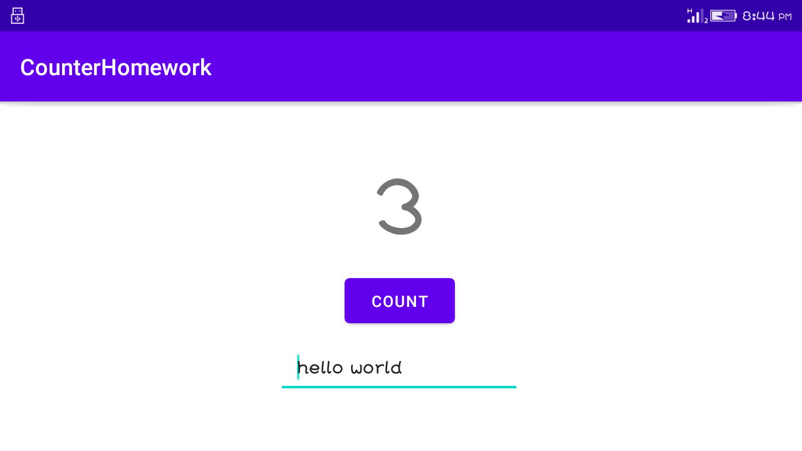

# Lab Work 5
## Two Activities Life Cycle (Homework)

**This is the fifth lab Exercise of "Two Activities Life Cycle" consists of one textview ,button ,editText and this readme file consist of the screenshot and video i.e. gif file for the final app created.**

## Landing Page UI

**The above screenshot show the home page of app with TextView,Button and EditText**

## Count Button Clicked and Message Insert 

**Above screenshot show the Count Button Clicked and Message Insert**

## Vertical view of App

**The above screenshot show the vertical view of app with save the data**

## Working functionality od App

**Above screenshot show the working functionality of Application. The UI consist of button,textview and edittext.
Button help to increase the counter value in textview and Edittext where we store the message. After the screen is
rotate the value or data are save without loosing it.**